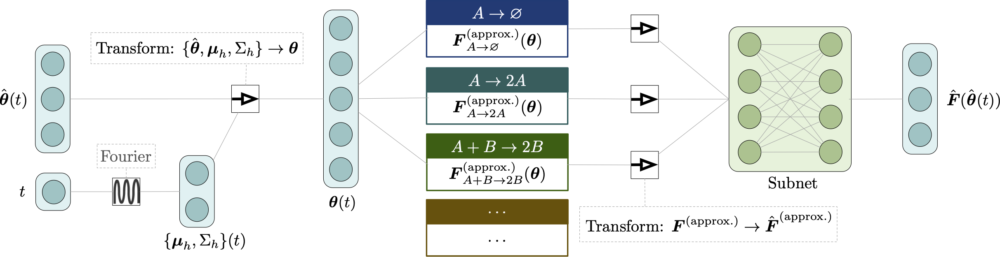
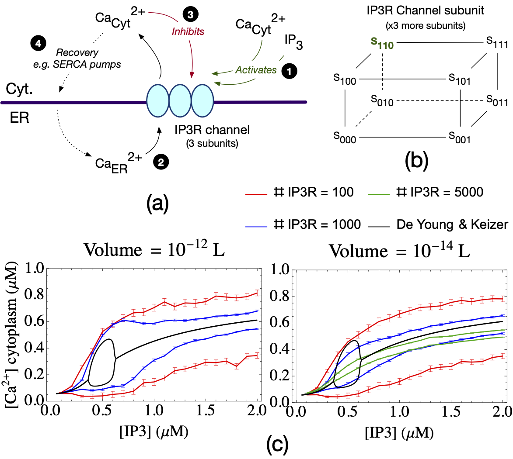
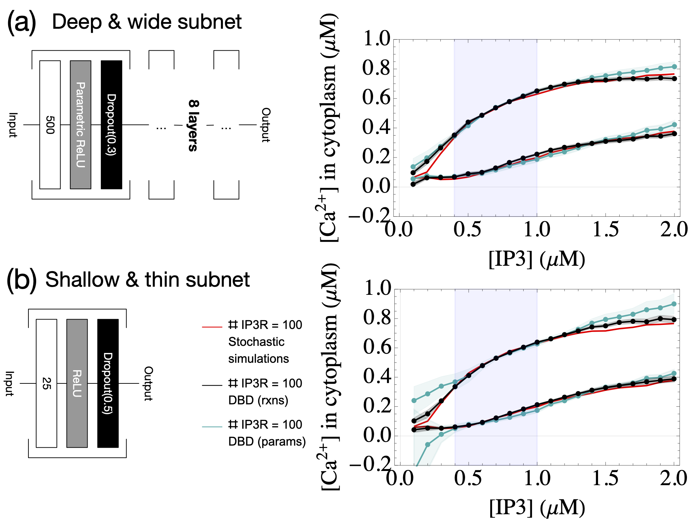
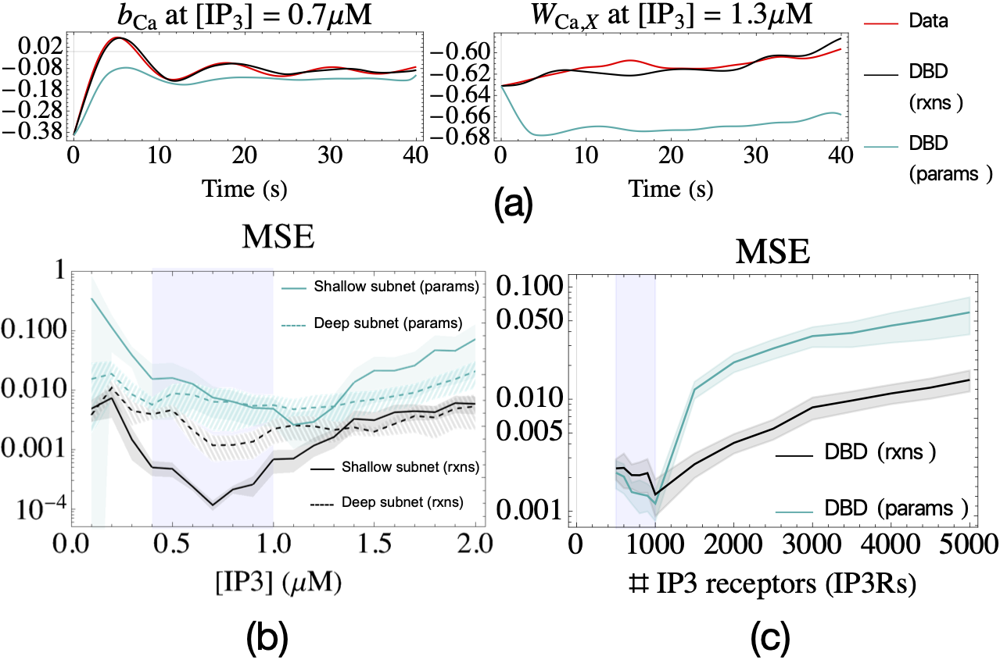

# Physics-based machine learning for modeling IP3 induced calcium oscillations

[](https://doi.org/10.5281/zenodo.4839127)

This repo. contains the code for the paper `Physics-based machine learning for modeling IP3 induced calcium oscillations`.



## Contents

* [learn_ip3](learn_ip3) - Models extrapolating in `IP3` for a single volume and number of `IP3Rs` (`IP3` receptors).
* [learn_ip3r](learn_ip3r) - Models extrapolating in the number of `IP3Rs` for a single volume, across all `IP3` values.
* [stochastic_simulations](stochastic_simulations) - Stochastic simulations for generating training data for both models.

The code is a mix of `Mathematica` notebooks and `C++`.

## Data

All data is stored using [DVC (data version control)](https://dvc.org). You need to install DVC, then you should be able to just run from this directory:
```
dvc pull
```
to get all the data. 

**BE AWARE** that this can be a lot to download, particularly because of the [stochastic_simulations](stochastic_simulations) - otherwise you can look for the `.dvc` files in the various directory and load those individually.

## Figures




